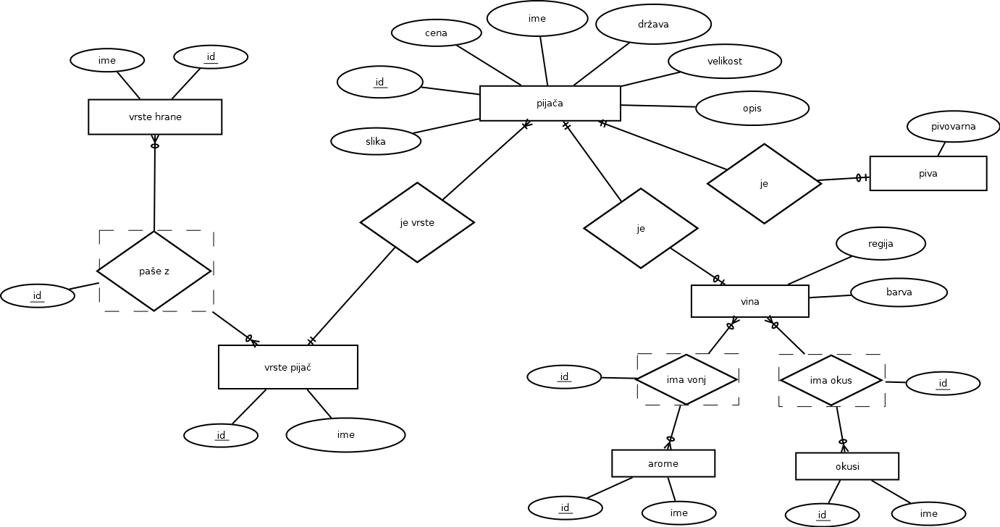

# Drinks and Things

To je aplikacija izdelana za projekt pri predmetu OPB. Namenjena je temu, da uporabnik najde primerno pijačo za k jedi. 
V aplikaciji izbere lastnosti svojega obroka ter preference glede pijače in dobi seznam priporočil. Podatkovna baza, 
ki jo aplikacija uporablja, vsebuje podatke iz spletne trgovine vina in piva. 

ER diagram podatkovne baze:

Zaradi enotnosti je celotna aplikacija spisana v angleščini.